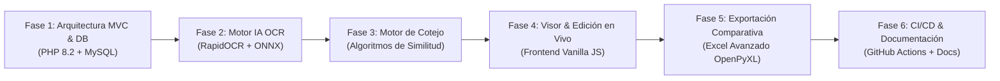

# 📋 Plan de Implementación y Evolución Técnica — Sistema OCR

Este documento detalla las fases estratégicas de ingeniería, modernización arquitectónica, inteligencia artificial y calidad ejecutadas en **Sistema OCR & Conciliación Documental**.

---

## 🗺️ Fases del Proyecto

---

### Fase 1: Arquitectura MVC & Capa de Persistencia
* Implementación del patrón Front Controller en `index.php` con Router y contenedor de inyección de dependencias (`Container`).
* Configuración de la base de datos relacional con sentencias preparadas PDO y modelos `Ficha`, `AspiranteExcel`, `DocumentoPdfOcr` y `Cruce`.
* Blindaje contra ataques CSRF y XSS mediante cabeceras seguras y tokens criptográficos.

### Fase 2: Motor de Inferencia OCR & Agrupación de Caras
* Integración del motor **RapidOCR (ONNX Runtime)** y rasterizado ultrarrápido con **PyMuPDF / fitz**.
* Decodificación de zonas MRZ de cédulas digitales colombianas.
* Lógica de agrupamiento inteligente de páginas para unificar frente y reverso de cada documento.

### Fase 3: Motor de Cotejo y Conciliación
* Algoritmos de similitud de texto y normalización fonética para contrastar datos leídos vs planilla oficial de Excel.
* Clasificación automática de estados: *Correctas*, *Con discrepancia*, *Solo en PDF* y *Solo en Excel*.

### Fase 4: Visor Interactivo y Edición en Tiempo Real
* Modal de alta fidelidad para inspeccionar el recorte de la cédula original.
* Edición manual de campos con recálculo dinámico de estados y actualización inmediata de contadores en el dashboard.

### Fase 5: Exportación Comparativa Corporativa (.xlsx)
* Generador de reportes en Excel con comparativa lado a lado (Cédula PDF vs Planilla Excel).
* Formato corporativo con estilos tipográficos, anchos automáticos ajustados y pestañas independientes para casos faltantes.

### Fase 6: Aseguramiento de Calidad, Pruebas y CI/CD
* Configuración de pipeline automatizado en GitHub Actions (`.github/workflows/ci.yml`).
* Suite de pruebas unitarias en PHPUnit y Python unittest.
* Suite documental completa en `docs/`.
